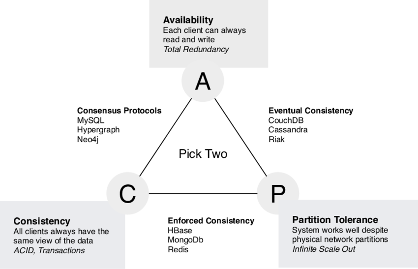

# CAP定理 CAP Theorem

稍微有一些计算机基础的人都知道，在设计算法的时候，需要考虑时间复杂度和空间复杂度，**时间换空间，空间换时间，**要根据实际情况来选择合适的算法，在时间和空间之间做权衡。系统设计也类似，需要在不同的选择之间做权衡，不过不是时间和空间，而是一致性\(consistency\)和可用性\(availability\)，也就是“**consistency换availability，availability换consistency**”，在整个系统设计的过程中，都要把这句话放在心上，这里说的consistency和availability就是CAP里面的C和A。

我一直认为系统设计应该多看资料，从不同的角度看同一个问题，所以除了我的总结之外，大家也可以参考其他人的总结。

* [The CAP FAQ](https://github.com/henryr/cap-faq) \(英文）
* [分布式理论基础 - CAP](cap.md)（中文）

总的来说，**CAP定理**（CAP theorem），又被称作**布鲁尔定理**（Brewer's theorem），它指出对于一个[分布式计算系统](https://zh.wikipedia.org/wiki/分布式计算)来说，不可能同时满足以下三点：

[一致性](https://zh.wikipedia.org/wiki/一致性)（Consistence） （等同于所有节点访问同一份最新的数据副本）

可用性（[Availability](https://zh.wikipedia.org/wiki/可用性)）（每次请求都能获取到非错的响应——但是不保证获取的数据为最新数据）

分区容错性（[Partition tolerance](https://zh.wikipedia.org/w/index.php?title=Partition_tolerance&action=edit&redlink=1)）即分布式系统在遇到某节点或网络分区故障的时候，仍然能够对外提供满足一致性和可用性的服务，以实际效果而言，分区相当于对通信的时限要求。系统如果不能在时限内达成数据一致性，就意味着发生了分区的情况，**必须就当前操作在C和A之间做出选择**

根据定理，**分布式系统只能满足三项中的两项而不可能满足全部三项**。理解CAP理论的最简单方式是想象两个节点分处分区两侧。允许至少一个节点更新状态会导致数据不一致，即丧失了C性质。如果为了保证数据一致性，将分区一侧的节点设置为不可用，那么又丧失了A性质。除非两个节点可以互相通信，才能既保证C又保证A，这又会导致丧失P性质。

CAP中的P指的是分区容错性，指的是 “The system continues to operate despite an arbitrary number of messages being dropped \(or delayed\) by the network between nodes”，通常我们在系统设计中，都会使用分布式的架构（多台机器），因为现在已经很难有一台服务器就能满足所有需求的情况了，虽然我们用了多台机器，但是对于外部（用户）来说，他们并不需要知道内部架构，他们通常把整个分布式系统看做一个整体，其中某几台机器坏了以后，系统还是需要能继续运行，**所以通常分布式系统是需要保证P \(partition tolerance\)的，根据CAP定理，三项不能完全满足，所以就需要在C\(consistency\)和 A\(availability\)做出权衡。**

## CP without A

不要求可用性，各台机器之间需要保证强一致性\(strong consistency\)，但是因为P（分区）的存在，在保证强一致性的时候需要各个机器之间同步，导致同步时间增加，影响可用性。

## AP without C

为了保证高可用性，就要牺牲一致性，当多个节点之间通信失败的时候，单个节点为了对请求做出响应，会使用本地的数据，这个数据可能过时了，从全局来看，数据并不是一致的。一般NoSQL都选择AP。

